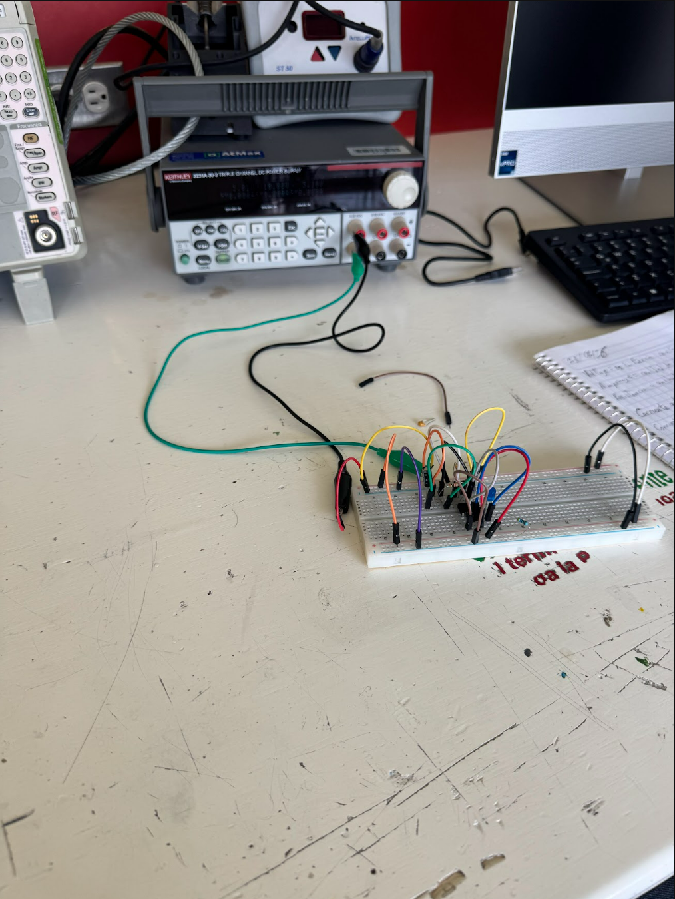
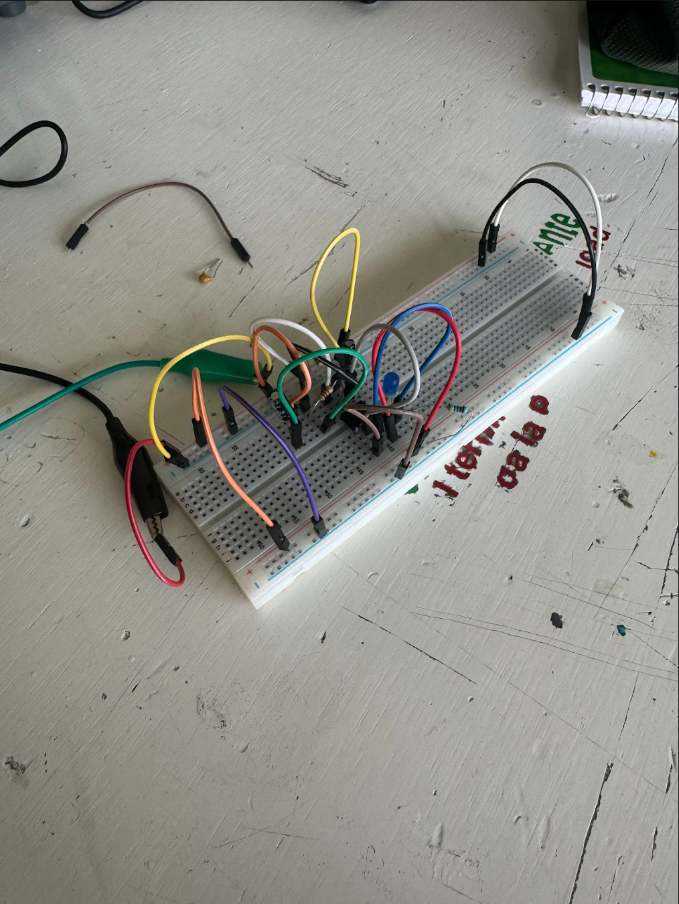

# Sesión 1 — Electronica
## Qué debía lograr hoy
Comprender los conceptos base de electricidad y electrónica (V, I, R, P, AC/DC), conocer componentes y equipos de medición, evitar errores típicos de montaje y construir un primer circuito funcional.

Qué usé

- Protoboard
- Cables
- Led
- Una resistencia 

[▶️ Ver video del circuito en funcionamiento](https://youtube.com/shorts/t93F0X8Y648?si=J8DNC3yvFRndBoM-)

En esta clase hicimos un circuito y hicimos que un led prendiera y usamos cables y fue bueno porque fue la primera vez que usamos el protoboard y tambien fue la primera  vez que trabajamos en equipo. 

## Qué falló y cómo lo resolví
- **Síntoma:** El circuito no encendía a la primera.
- **Cómo lo encontré:** Revisamos las conexiones de los cables y la orientación del LED en el protoboard y revisar de que todo estuviera bien conectado y checamos tierra y corrienta.
- **Solución:** Acomodamos bien los cables en la misma línea del protoboard para que hicieran contacto.

## Qué aprendí
Aprendí a a usar la protoboard y el como funciona y que es fundamental saber que es GND y porque es util al momento de armas, a identificar cómo fluye la corriente en sus líneas y a conectar componentes básicos como la resistencia y el LED.
