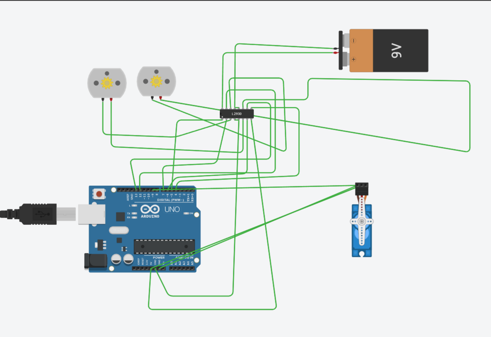

# Sesión 3 -Actuadores


## Qué debía lograr hoy
Controlar un motor DC con puente H (sentido de giro y velocidad por PWM) y un servo, midiendo corriente y comportamiento bajo carga.


## Qué usé
- Simulador en línea Tinkercad
- Placa Arduino (Simulada)
- Circuito integrado Puente H L293D
- Servomotor (Conectado al pin 9)
- 2 Motores de corriente directa (DC)
- Batería de 9V (Potencia externa)


## Qué hice y qué pasó (evidencia)


### Código Fuente del Programa (Control de Motores y Secuencia)

```cpp
// C++ code
//

void adelante(){
  digitalWrite(6, HIGH);
  digitalWrite(7, LOW);
  digitalWrite(13, HIGH);
  digitalWrite(12, LOW);
}

void atras(){
  digitalWrite(7, HIGH);
  digitalWrite(6, LOW);
  digitalWrite(12, HIGH);
  digitalWrite(13, LOW);
}

void izq(){
  digitalWrite(6, HIGH);
  digitalWrite(7, LOW);
  digitalWrite(13, HIGH);
  digitalWrite(12, LOW);
}
void setup()
{
  //MOTOR1
  pinMode(6, OUTPUT); //OUT1
  pinMode(7, OUTPUT); //OUT2

  pinMode(5, OUTPUT); //ENABLE
  digitalWrite(5, HIGH);
  //Motor2
  pinMode(12, OUTPUT); //OUT1
  pinMode(13, OUTPUT); //OUT2
  pinMode(4, OUTPUT); //ENABLE
  digitalWrite(4, HIGH);
}

void loop()
{
  adelante();
  delay(1000);
  atras();
}
```

### Código Fuente del Programa (Control de Motores y Servomotor Completo)

```cpp
// C++ code
//
#include <Servo.h>

Servo arduino;

void adelante(){
  digitalWrite(6, HIGH);
  digitalWrite(7, LOW);
  digitalWrite(13, HIGH);
  digitalWrite(12, LOW);
}

void atras(){
  digitalWrite(7, HIGH);
  digitalWrite(6, LOW);
  digitalWrite(12, HIGH);
  digitalWrite(13, LOW);
}

void izq(){
  digitalWrite(6, HIGH);
  digitalWrite(7, LOW);
  digitalWrite(13, HIGH);
  digitalWrite(12, HIGH);
}

void setup()
{
  //SERVO
  arduino.attach(9);

  //MOTOR1
  pinMode(6, OUTPUT); //OUT1
  pinMode(7, OUTPUT); //OUT2

  pinMode(5, OUTPUT); //ENABLE
  digitalWrite(5, HIGH);
  //Motor2
  pinMode(12, OUTPUT); //OUT1
  pinMode(13, OUTPUT); //OUT2
  pinMode(4, OUTPUT); //ENABLE
  digitalWrite(4, HIGH);
}

void loop()
{
  arduino.write(0);
  adelante();
  delay(1000);
  atras();
  delay(1000);
  arduino.write(90);
  izq();
  arduino.write(180);
  delay(1000);
}
```




[▶️ Ver video del circuito y servomotor en funcionamiento en YouTube](https://youtu.be/1D5kelYyCuQ?si=hd1ZztO4-_cKGVOp)


## Qué falló y cómo lo resolví
- **Síntoma:** Al agregar el servomotor, el código marcaba errores si intentábamos moverlo directament.**Cómo lo encontré:** El compilador de Tinkercad resaltaba errores en las funciones relacionadas con el servo.
- **Solución:** Incluimos la cabecera `#include <Servo.h>` al inicio del programa, declaramos el objeto de manera global y usamos `.attach(9)` dentro del setup para asociar físicamente el pin de control.

## Qué aprendí
Aprendí a integrar múltiples tipos de actuadores en un solo programa de Arduino, entendiendo cómo secuenciar movimientos complejos usando retardos (`delay`) y cómo manipular los ángulos de un servomotor (`.write()`) en sincronía con motores de corriente directa.
