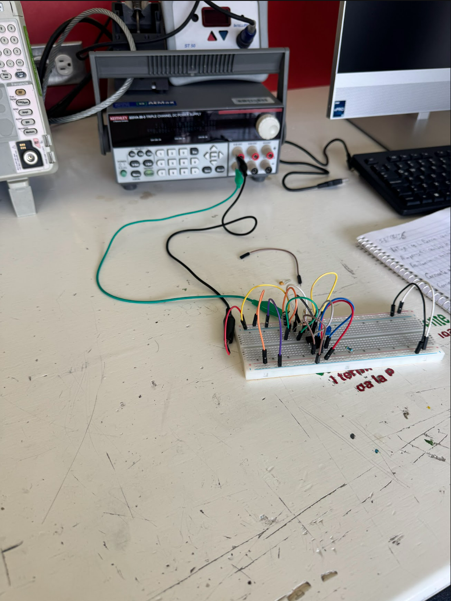
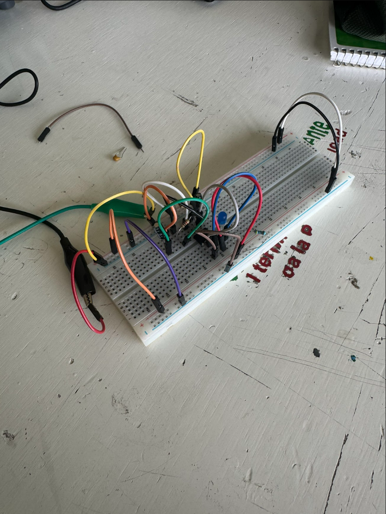

# Sesión 4 — Mecanismos
## Qué debía lograr hoy
Objetivo: Entender cómo los mecanismos transforman el movimiento (velocidad ↔ par, rotación ↔ traslación, continuo ↔ intermitente), calcular relaciones de transmisión simples y aplicarlo al tren motriz del carro — tocando mecanismos reales en un taller de estaciones.

Qué usé

- Libreta
- Pluma 

En esta clase hicimos un circuito y hicimos que un led prendiera y usamos cables y fue bueno porque fue la primera vez que usamos el protoboard y tambien fue la primera  vez que trabajamos en equipo. 

## Qué falló y cómo lo resolví
- **Síntoma:** El circuito no encendía a la primera.
- **Cómo lo encontré:** Revisamos las conexiones de los cables y la orientación del LED en el protoboard y revisar de que todo estuviera bien conectado y checamos tierra y corrienta.
- **Solución:** Acomodamos bien los cables en la misma línea del protoboard para que hicieran contacto.

## Qué aprendí
Aprendimos los movimientos de los 
